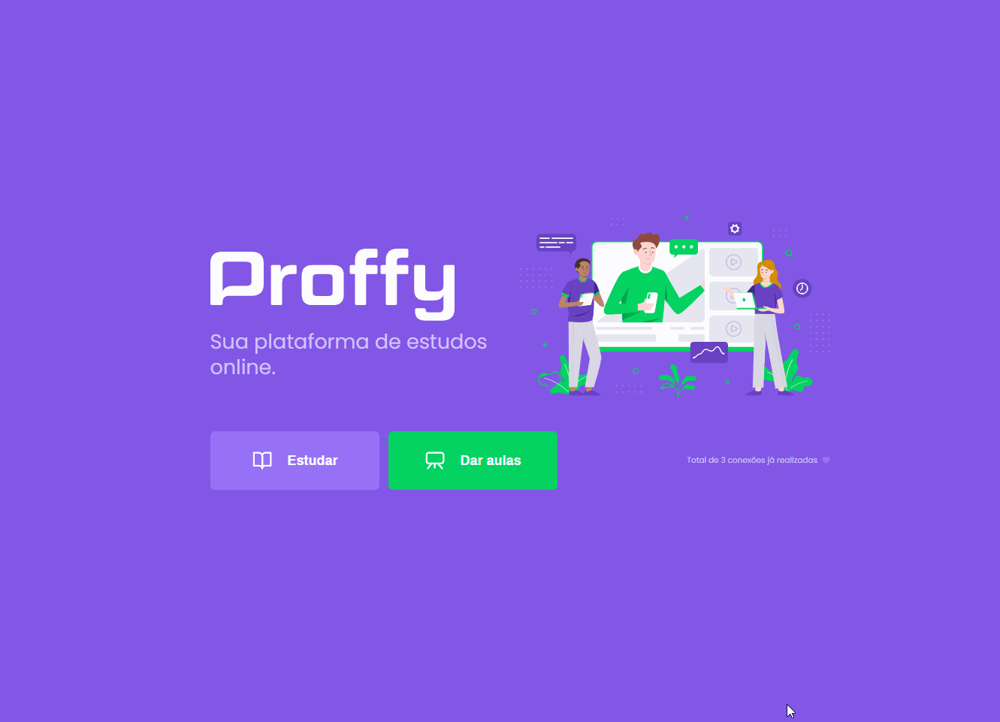
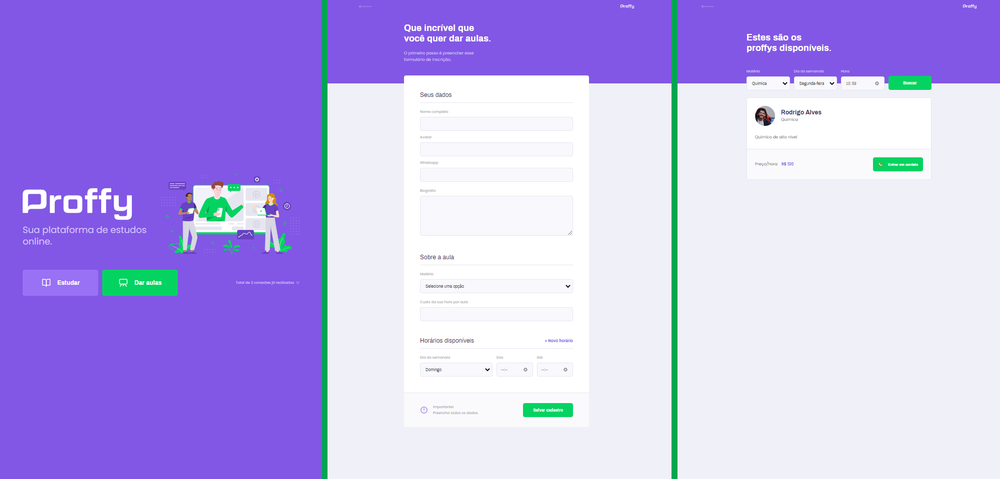

<h1 align="center">
<br>
  
<br>

<a target="_blank" href="https://github.com/RodzAlves/proffy-api">
    
  </a>
<a href="https://reactjs.org/">
  
</a>

</h1>

## 💻 Project
Proffy is a platform to connect students and teachers, it is possible to filter teachers with availability on each day or different time.

💡 This repository refers to the project's Web Frontend.

<h3 align="center">
  
<h3>

## 🎨 Screens

<h3 align="center">
  
<h3>

> Responsive with the mobile-first methodology

## 🚀 Technologies

The project was developed with these technologies:

- ✔️ ReactJS

- ✔️ React Router DOM

- ✔️ Axios

- ✔️ TypeScript


## ⚙ Run Frontend (Web)

To run the application you will need:
* [Run the API Proffy](https://github.com/RodzAlves/proffy-api)

Now follow the steps:
```bash
# to clone the repository
$ https://github.com/RodzAlves/proffy-web.git

# go into the web folder
$ cd proffy-web

# install dependencies
$ yarn or npm install 

# run frontend
$ yarn start or npm run start

# the server will be running on port 3000 - http://localhost:3000
```


<br>
<h3 align="center">
  
  Made with 💜 by Rodrigo Alves 👋 <br>
   <a href="https://www.linkedin.com/in/rodrigo-alves-dev/" alt="LinkedIn" target="blank">
    
  </a>
</h3>
<br>
